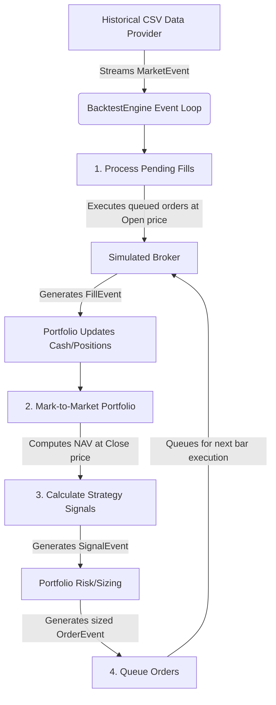

# Event-Driven Backtesting Architecture

This document describes the core design and architectural components of the **Antos** event-driven backtesting platform.

## Design Philosophy

The backtester is structured as an **event-driven simulation engine**. Unlike vectorised backtesters (e.g., simple Pandas-based calculations), an event-driven design processes market data sequentially, bar-by-bar. This design yields several distinct advantages:

1. **Elimination of Lookahead Bias:** Calculations are strictly isolated chronologically. A strategy can only view historical or current bar data, making it impossible to accidentally query future prices.
2. **Realistic Execution Modeling:** Orders generated on a given bar's Close price are executed on the *next* bar's Open price, simulating the latency of real-world order transmission.
3. **Flexible Asset Management:** Multiple asset streams are merged chronologically, allowing multi-asset portfolios to be simulated with correct temporal alignment.
4. **Seamless Transition to Live Trading:** The event loop, message passing, and interface specifications are identical to those required for real-time execution handlers and broker API integrations.

---

## Event Lifecycle

The execution flow of a single bar inside the [BacktestEngine](file:///Users/flipis/dev/antos/src/engine.py) follows a strict sequence to maintain simulation integrity:

### Detailed Execution Steps:
1. **Incorporate Market Events:** The [HistoricalCSVDataProvider](file:///Users/flipis/dev/antos/src/data_provider.py) yields a `MarketEvent` containing the OHLCV details of the current bar for a specific symbol.
2. **Process Yesterday's Pending Orders:** The `BacktestEngine` routes the `MarketEvent` to the [SimulatedBroker](file:///Users/flipis/dev/antos/src/execution/sim_broker.py). The broker executes any pending orders for this symbol using the current bar's **Open** price (not the Close price). Slippage and commission adjustments are calculated and applied here.
3. **Update Portfolio Accounting:** For every filled trade, a `FillEvent` is emitted. The [Portfolio](file:///Users/flipis/dev/antos/src/portfolio.py) processes this fill, adjusting cash balances, positions, and recalculating weighted average entry price.
4. **Mark-to-Market Valuation:** Once fills are processed, the portfolio updates its current valuations using the current bar's **Close** price. Net Asset Value (NAV), holdings values, and historical equity curves are updated and snapshot.
5. **Generate Strategy Signals:** The strategy engine evaluates the new price data point. If criteria are met, it yields a `SignalEvent` (LONG, SHORT, or EXIT) containing a recommended signal strength.
6. **Order Generation and Sizing:** The portfolio intercepts the strategy signals. Sizing is computed relative to the overall Net Asset Value (NAV) (e.g., allocating a percentage of total NAV to the trade) to ensure sizing scales with portfolio growth. If cash is available (enforcing a strict cash-account model with no margin borrowing), the portfolio generates an `OrderEvent`.
7. **Queue Orders:** Sized orders are queued in the broker's pending queue, waiting to be evaluated at the beginning of the next bar.

---

## Core Classes and Event Models

### 1. Event Models ([src/events.py](file:///Users/flipis/dev/antos/src/events.py))
All messages passing through the system subclass the base `Event` class:
* **`MarketEvent`:** Stores timestamp, symbol, open, high, low, close, volume.
* **`SignalEvent`:** Emitted by strategies. Contains ticker symbol, direction (`LONG`, `SHORT`, `EXIT`), and confidence/strength factor.
* **`OrderEvent`:** Emitted by the portfolio. Contains ticker symbol, execution type (`MKT` or `LMT`), quantity, and buy/sell direction.
* **`FillEvent`:** Emitted by execution handlers. Captures executed quantity, fill price, commission fee, and slippage.

### 2. Historical Data Provider ([src/data_provider.py](file:///Users/flipis/dev/antos/src/data_provider.py))
The [HistoricalCSVDataProvider](file:///Users/flipis/dev/antos/src/data_provider.py) parses historical CSV files, converts raw data frames into `MarketEvent` sequences, and sorts them chronologically. To prevent non-deterministic order processing when multiple assets share the same timestamp (e.g. daily close for multiple stocks), it uses a secondary sorting key based on ticker symbol.

### 3. Portfolio Tracking and Risk Manager ([src/portfolio.py](file:///Users/flipis/dev/antos/src/portfolio.py))
The [Portfolio](file:///Users/flipis/dev/antos/src/portfolio.py) handles the financial book of record:
* **Position Tracking:** Keeps track of share counts per symbol (positive for Long, negative for Short) and average cost basis.
* **Sizing Rules:** Sizing uses the NAV-based formula:
  $$\text{Target Notional} = \text{Net Asset Value (NAV)} \times \text{Signal Strength}$$
  $$\text{Target Quantity} = \lfloor \frac{\text{Target Notional}}{\text{Current Price}} \rfloor$$
* **Capital Protection:** A pre-trade clamping check adjusts order quantities to ensure the cost does not exceed available cash, preventing accidental leverage or margin calls.

### 4. Broker Execution Handler ([src/execution/sim_broker.py](file:///Users/flipis/dev/antos/src/execution/sim_broker.py))
The [SimulatedBroker](file:///Users/flipis/dev/antos/src/execution/sim_broker.py) acts as a local proxy for a brokerage:
* **Anti-Lookahead Fill Mechanism:** Implements the key constraint of executing orders at the *Open price* of the *next* bar.
* **Friction Modelling:**
  * **Commission Rate:** Multiplicative cost based on total transaction volume.
  * **Slippage Modeling:** Shifts the fill price in the direction of the trade (fill price moves higher for purchases, lower for sales) to simulate order book liquidity consumption.
