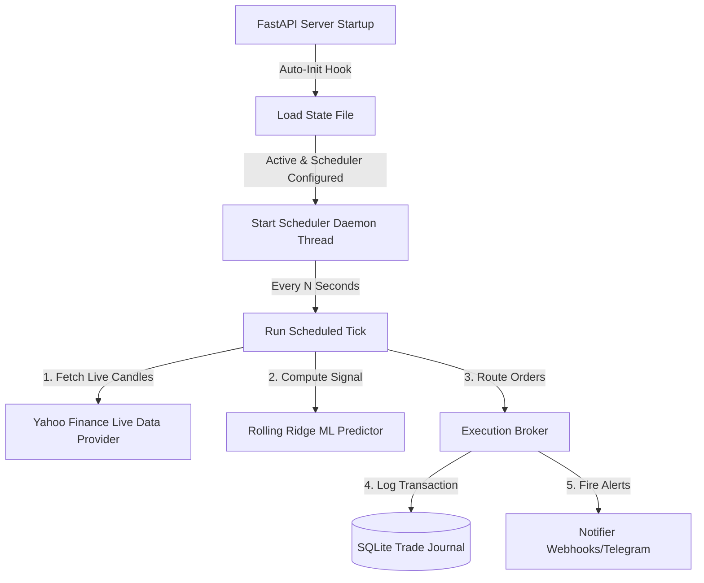

# Antos Paper Trading System Documentation

This document outlines the architecture, persistence layers, configuration schemas, and recovery protocols for the automated paper trading system.

---

## 1. System Architecture

The paper trading system runs as a stateful, background service integrated directly into the FastAPI application server.



### Core Components
*   **Live Data Feed ([live_data_provider.py](file:///Users/flipis/dev/antos/src/live_data_provider.py))**: Fetches daily candle updates using Yahoo Finance APIs in bulk, eliminating lookahead bias.
*   **Background Scheduler ([scheduler.py](file:///Users/flipis/dev/antos/src/scheduler.py))**: A lightweight daemon thread executing tick functions at a configured frequency.
*   **Execution Broker ([paper_broker.py](file:///Users/flipis/dev/antos/src/execution/paper_broker.py))**: Conforms to the `BaseExecutionHandler` interface. Supports both simulated fills (using Yahoo Finance prices) and live integrations (via Alpaca Paper API endpoints).
*   **Outbound Alerts ([notifier.py](file:///Users/flipis/dev/antos/src/notifier.py))**: Sends instant notifications to configured Discord, Slack, or Telegram channels when orders queue, fills complete, or risk limits are breached.
*   **Trade Journal ([journal.py](file:///Users/flipis/dev/antos/src/journal.py))**: A transactional SQLite ledger recording executions and compiling quantitative metrics.

---

## 2. Persistence & Recovery Mechanics

### Data Persistence
All state data is written to the host system directory mapped via the Docker volume mount:
*   **Bot State File (`data/live_bot_state.json`)**: Contains details on active symbols, current positions, indicators history, starting capital, and scheduler parameters.
*   **Trade Ledger (`data/trade_journal.db`)**: An SQLite database containing records of all executed transactions and realized profits.

### Recovery Protocols
*   **Container Crash/Reboot**: The container is configured with `restart: unless-stopped` in `docker-compose.yml`. The Docker daemon will immediately restart the container if it exits.
*   **Re-activation Hook**: On FastAPI module initialization, [bot.py](file:///Users/flipis/dev/antos/api/routes/bot.py) automatically invokes `init_scheduler_from_state()`. This reads `live_bot_state.json` and automatically respawns the background scheduler thread if the bot was previously active, restoring the tick loop immediately without data loss.

---

## 3. Operational Command API Reference

Use these endpoints to manually manage the bot's state or query its logs:

### A. Initialize & Start the Bot
Configures and launches the bot with a given strategy, symbols list, and initial fund.

*   **Endpoint**: `POST /api/bot/start`
*   **Request Payload**:
```json
{
  "strategy_id": "rolling_ridge",
  "symbols": ["SPY", "BTC-USD"],
  "initial_cash": 10000.0,
  "commission_rate": 0.001,
  "slippage_rate": 0.0005,
  "params": {
    "lookback_window": 90,
    "l2_lambda": 1.0,
    "prediction_threshold": 0.001,
    "strength": 0.50
  },
  "live_mode": true,
  "broker_type": "simulated"
}
```

### B. Activate/Update Scheduler
Starts the background scheduled execution. If already running, updates the polling interval dynamically.

*   **Endpoint**: `POST /api/bot/scheduler/start`
*   **Request Payload**:
```json
{
  "interval_seconds": 86400
}
```

### C. Stop Scheduler
Halts the automated background loop without clearing the current portfolio allocations.

*   **Endpoint**: `POST /api/bot/scheduler/stop`

### D. Stop Bot & Liquidate
Stops background threads and marks the bot inactive. Positions are frozen at their current state.

*   **Endpoint**: `POST /api/bot/stop`

### E. Hard Reset State
Completely wipes out active logs, trade journals, and resets state parameters.

*   **Endpoint**: `POST /api/bot/reset`

### F. Query SQL Trade Journal
Retrieves historic trades and performance metrics calculated via SQL aggregate queries.

*   **Endpoint**: `GET /api/bot/journal?limit=100`
*   **Response Payload**:
```json
{
  "trades": [
    {
      "id": 1,
      "timestamp": "2026-06-27 02:40:00",
      "strategy_id": "rolling_ridge",
      "symbol": "SPY",
      "direction": "BUY",
      "quantity": 10,
      "price": 550.00,
      "commission": 5.50,
      "realized_pnl": 0.0,
      "remaining_cash": 4494.50,
      "position_after": 10
    }
  ],
  "metrics": {
    "total_trades": 1,
    "total_pnl": 0.0,
    "win_rate_pct": 0.0,
    "profit_factor": 1.0
  }
}
```

---

## 4. Alerting Configuration

To receive notifications on Discord, Slack, or Telegram, configure these environment variables in your environment or Docker container wrapper:

```bash
# Notification channels configurations
export NOTIFIER_TYPE="webhook,telegram"
export NOTIFIER_WEBHOOK_URL="https://discord.com/api/webhooks/your-webhook-id"
export NOTIFIER_TELEGRAM_TOKEN="your-bot-token"
export NOTIFIER_TELEGRAM_CHAT_ID="your-chat-id"
```

The system will generate alert events on:
1.  **Order Placements**: Notifies immediately when target buy/exit orders are submitted to the queue.
2.  **Order Fills**: Logs details of completed trades with pricing, quantities, and transaction costs.
3.  **Drawdown Breaches**: Triggers warnings if portfolio drawdown falls below **-10%** and hits a new local maximum.

---

## 5. Troubleshooting & Maintenance

### Inspect Logs
To verify that the scheduler is firing callbacks in the background:
```bash
docker logs antos_server -f
```
Look for lines matching:
```text
INFO:src.scheduler:Scheduler triggering bot tick callback.
INFO:api.routes.bot:Scheduled tick executed successfully.
```

### Manual Tick Override
To force-simulate a tick execution without waiting for the scheduled window (useful for debugging):
*   **Endpoint**: `POST /api/bot/tick`
*   Or click the **Trigger Daily Tick** button on the browser dashboard.
